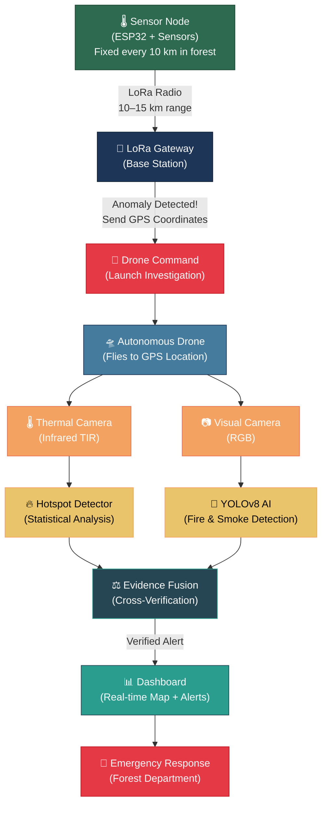
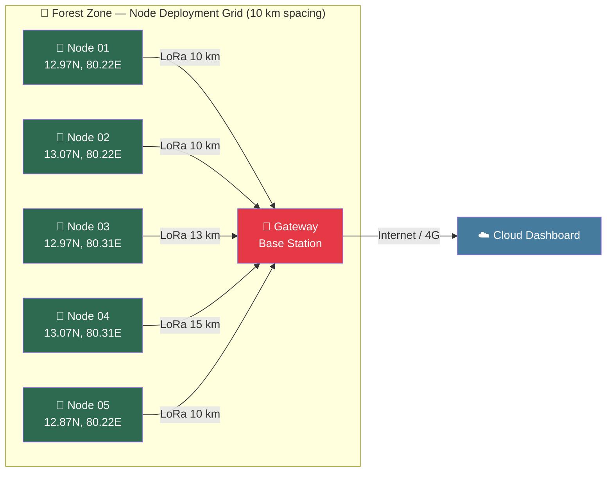
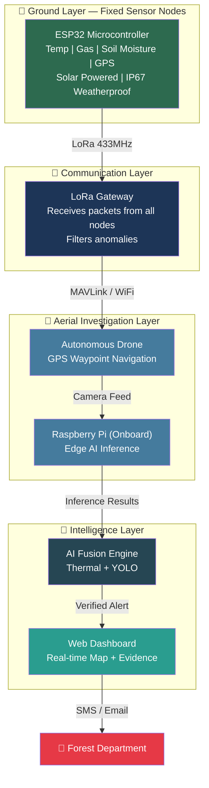
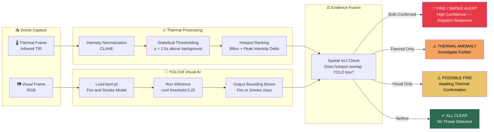
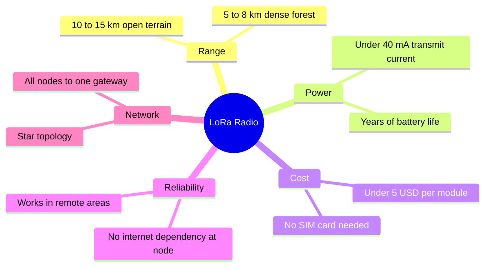
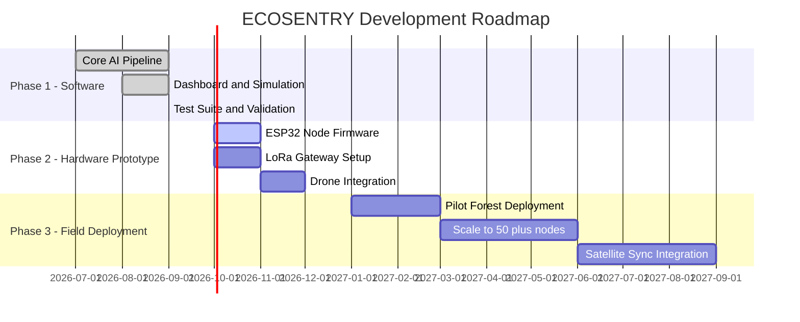

<div align="center">

# 🌿 ECOSENTRY

### *Resilient, AI-Powered Environmental Monitoring Network for Early Disaster Detection*

[](https://www.sih.gov.in/)
[](https://www.sih.gov.in/)
[](https://www.sih.gov.in/)
[](https://www.python.org/)
[](https://ultralytics.com/)

> **Forests cannot speak. ECOSENTRY listens.**
>
> A network of intelligent sensor nodes deployed across dense forests — **10 km apart** — working silently 24/7 to detect the earliest signs of wildfire, long before flames can spread.

</div>

---

## 🔥 The Problem

Every year, **millions of hectares of forest** are destroyed by wildfires that go undetected until it is too late. Traditional monitoring methods — satellite imagery, fire watchtowers, manual patrolling — all suffer from:

| Problem | Impact |
|---|---|
| ⏱️ **Detection Delay** | Satellites pass every 1–3 hours; fires spread in minutes |
| 🌫️ **Smoke Blindness** | Visual cameras fail in heavy smoke |
| 📡 **No Infrastructure** | Remote forests have zero communication coverage |
| ❌ **False Alarms** | Sun-heated rocks, vehicles trigger costly false positives |
| 🧭 **No Location Precision** | Alerts without GPS coordinates delay response |

**ECOSENTRY solves all of this** with a resilient mesh of fixed sensor nodes, LoRa radio telemetry, and AI-powered drone verification.

---

## 💡 How ECOSENTRY Works — Three Layers

```
🌳 Ground Layer  →  Fixed Sensor Nodes (every 10 km across the forest)
📡 Radio Layer   →  LoRa Long-Range Wireless Telemetry (no internet needed)
🚁 Sky Layer     →  AI Drone with Thermal + Visual Cameras
```

### Complete System Flow



---

## 🗺️ Node Network — Deployment Concept

Each sensor node covers roughly a **10 km radius**. Nodes are deployed in a grid so there are **zero gaps** in monitoring coverage.



> **Coverage Calculation:** Each node covers ~314 km² (π × 10²). A 5-node grid protects over **1,500 km²** of forest with overlapping coverage for redundancy.

---

## 🧱 System Architecture Overview



---

## ⚙️ Hardware Components

### 🌡️ Ground Sensor Node (one per deployment point)

| Component | Model | Purpose |
|---|---|---|
| Microcontroller | ESP32 DevKit V1 | Core processor, WiFi/BT capable |
| LoRa Radio | SX1278 / RFM95W | Long-range 10–15 km data transmission |
| Temperature Sensor | DHT22 / DS18B20 | Ambient temperature monitoring |
| Gas Sensor | MQ-2 / MQ-135 | Smoke, CO, LPG detection |
| Soil Moisture | Capacitive Sensor | Dry vegetation risk assessment |
| GPS Module | NEO-6M | Precise node location tagging |
| Power | Solar Panel + LiPo | Off-grid continuous operation |
| Enclosure | IP67 Waterproof Box | Outdoor forest deployment |

### 🚁 Aerial Investigation Unit (Drone)

| Component | Model | Purpose |
|---|---|---|
| Flight Controller | Pixhawk 4 / ArduPilot | Autonomous GPS waypoint navigation |
| Companion Computer | Raspberry Pi 4 / 5 | Runs AI inference at the edge |
| Thermal Camera | MLX90640 / FLIR Lepton 3.5 | Infrared hotspot detection |
| Visual Camera | Pi Camera v3 | RGB fire/smoke YOLO input |
| Connectivity | 4G LTE Module | Real-time data uplink to dashboard |

---

## 🧠 AI Detection Pipeline



### Alert Levels

| Alert Level | Meaning | Action Required |
|---|---|---|
| ✅ **ALL CLEAR** | All sensors normal | Continue monitoring |
| ⚠️ **WARNING** | Ground sensors flagged, drone shows nothing | Watch closely |
| 🌡️ **THERMAL ANOMALY** | Heat detected, no visible flame | Could be hot rock or machinery |
| 🔥 **POSSIBLE FIRE** | Visual smoke/fire without thermal confirmation | Deploy ranger patrol |
| 🚨 **FIRE / SMOKE ALERT** | Both thermal AND visual confirmed | Immediate emergency response |

---

## 📡 Why LoRa — The Smart Radio Choice for Forests



**Sensor data packet (sent every 60 seconds):**
```json
{
  "node_id": "NODE_01",
  "latitude": 12.9716,
  "longitude": 80.2209,
  "temperature_c": 68.5,
  "gas_level": 82.0,
  "soil_moisture_pct": 15.0,
  "timestamp": "2026-09-25T10:30:00Z",
  "alert": true
}
```

---

## 🚀 Quick Start — Run the Demo

> No hardware needed! Run the complete system simulation on any laptop.

### Step 1 — Install Dependencies
```bash
git clone https://github.com/your-username/ecosentry.git
cd ecosentry
python -m pip install -r requirements.txt
```

### Step 2 — Verify All Components
```bash
python tests/test_components.py
```

### Step 3 — Run Full End-to-End Simulation
```bash
python simulation/run_demo.py
```

This simulates the complete flow:
- Sensor nodes transmit LoRa packets
- Gateway detects anomaly at Node 01
- Drone dispatched to GPS coordinates
- Thermal + YOLO AI runs on captured frames
- Evidence fusion generates verified alert
- Results saved to `results/`

### Step 4 — Launch Live Dashboard
```bash
python ecosentry/dashboard/app.py
```
Open **http://localhost:5000** to view live telemetry, bounding boxes, and evidence images.

---

## 📁 Repository Structure

```
ecosentry/
├── README.md                    ← You are here
├── requirements.txt             ← Python dependencies
│
├── ecosentry/                   ← Core Python package
│   ├── sensor/                  ← ESP32 node simulation
│   │   └── sensor_node.py
│   ├── gateway/                 ← LoRa gateway simulation
│   │   └── gateway.py
│   ├── drone/                   ← Drone + camera simulation
│   │   ├── drone_controller.py
│   │   └── camera.py
│   ├── thermal/                 ← Infrared hotspot detection
│   │   ├── preprocessor.py
│   │   └── hotspot_detector.py
│   ├── yolo/                    ← YOLOv8 fire/smoke detector
│   │   └── fire_detector.py
│   ├── verification/            ← Spatial cross-validation
│   │   └── fire_verifier.py
│   ├── fusion/                  ← Multi-modal evidence fusion
│   │   └── evidence_fusion.py
│   ├── alerts/                  ← Alert builder and formatter
│   │   └── alert_manager.py
│   ├── dashboard/               ← Flask web dashboard
│   │   ├── app.py
│   │   └── templates/index.html
│   └── models/
│       └── best.pt              ← Pre-trained YOLO weights
│
├── simulation/                  ← Full demo runner
│   └── run_demo.py
│
├── tests/                       ← Component test suite
│   └── test_components.py
│
├── results/                     ← Generated alert evidence output
│   ├── latest_alert.json
│   ├── composite_evidence.png
│   ├── drone_thermal_evidence.png
│   └── yolo_fire_detection.png
│
├── examples/                    ← Demo input media
│   └── hotspot-detect.gif
│
└── docs/                        ← Technical documentation
    ├── architecture.md
    └── workflow.md
```

---

## 📊 Technical Specifications

| Parameter | Value |
|---|---|
| Node Spacing | 10 km apart |
| LoRa Range | 10–15 km open, 5–8 km forested |
| Coverage per Node | ~314 km² (π × 10²) |
| Sensor Read Interval | Every 60 seconds |
| Alert Latency | Less than 2 minutes (trigger to alert) |
| AI Model | YOLOv8 Nano — edge optimized |
| Detection Classes | Fire, Smoke |
| YOLO Confidence Threshold | 0.25 |
| Thermal Threshold | Mean + 2.5 × Standard Deviation |
| Node Power | ~200 mW average (solar powered) |
| Operating Temperature | -10°C to +60°C |
| Communication | LoRa 433 MHz / 915 MHz |

---

## 🌐 Development Roadmap



### Hardware Integration Path

| Phase | Task | Technology |
|---|---|---|
| Phase 2 — Nodes | Flash sensor logic onto ESP32 | Arduino IDE + FreeRTOS |
| Phase 2 — Radio | Connect SX1278 LoRa transceiver via SPI | MicroPython / Arduino |
| Phase 2 — Gateway | Raspberry Pi LoRa packet receiver | Python + PySerial |
| Phase 2 — Drone | Interface with ArduPilot flight controller | MAVLink / pymavlink |
| Phase 3 — Thermal | Connect MLX90640 or FLIR Lepton camera | I2C / SPI |
| Phase 3 — Cloud | MQTT broker for multi-gateway uplink | AWS IoT / Mosquitto |

---

## 🤝 Attribution

- **Project:** Smart India Hackathon 2026 — Problem Statement SIH26178
- **Theme:** Disaster Management
- **Category:** Hardware and Edge AI
- **YOLO Weights:** [luminous0219/fire-and-smoke-detection-yolov8](https://github.com/luminous0219/fire-and-smoke-detection-yolov8)
- **AI Framework:** [Ultralytics YOLOv8](https://ultralytics.com/)

---

<div align="center">

**Built with love for India's Forests**

*"Detect early. Respond fast. Save forests."*

</div>
