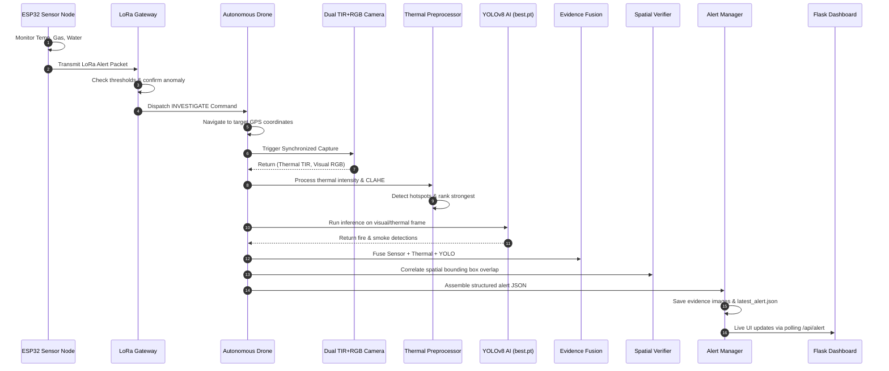

# ECOSENTRY Operational Workflow

This document details the complete 14-step operational lifecycle executed by ECOSENTRY during an environmental disaster monitoring event.

---

## 14-Step Lifecycle Sequence

---

## Detailed Step Breakdown

| Step | Component | Action & Description | Output / Artifact |
| :---: | :--- | :--- | :--- |
| **1** | Sensor Node | Monitors environmental parameters (Temp: 68.5, Gas: 82.0, Water: 15.0%). | Raw environmental readings |
| **2** | Sensor Node | Evaluates readings against safe thresholds. Creates alert packet. | JSON packet (`status: ABNORMAL...`) |
| **3** | LoRa Gateway | Ingests low-bandwidth radio packet via simulated RFM95/SX1278 transceiver. | Console log & telemetry validation |
| **4** | LoRa Gateway | Confirms violation; creates `INVESTIGATE` drone command with target lat/lon. | Dispatch payload (`command: INVESTIGATE`) |
| **5** | Drone Controller | Simulates autonomous flight to target GPS coordinates (e.g. 12.9716, 80.2209). | State: `ON_STATION` |
| **6** | Drone Camera | Splits side-by-side composite into synchronized Thermal TIR and Visual RGB frames. | `(thermal_frame, visual_frame)` |
| **7** | Thermal Module | Applies safe min-max scaling and CLAHE contrast enhancement. | Standardized 2D intensity array |
| **8** | Hotspot Detector | Computes adaptive threshold ($T = \text{median} + 2.5\sigma$); isolates anomalies. | List of hotspots + Strongest hotspot |
| **9** | YOLOv8 Detector | Runs inference using `ecosentry/models/best.pt` via Ultralytics engine. | Bounding boxes, classes (`fire`, `smoke`), confidence |
| **10** | Evidence Fusion | Synthesizes ground sensor readings, thermal delta, and YOLO detections. | Alert Level (e.g. `FIRE / SMOKE ALERT`) |
| **11** | Spatial Verifier | Checks spatial intersection between hotspot boxes and YOLO boxes (IoU / IoH). | Corroboration count & verification reason |
| **12** | Evidence Saver | Overlays detection boxes and telemetry banners on saved images. | `results/drone_thermal_evidence.png`, `results/yolo_fire_detection.png` |
| **13** | Alert Manager | Compiles complete audit log into JSON file. | `results/latest_alert.json` |
| **14** | Web Dashboard | Displays live system cards, metric gauges, and auditable evidence in browser. | Flask server at `http://localhost:5000` |

---

## Integrity Principles

1. **No Fake Radiometric Data:** Uncalibrated thermal images represent relative pixel intensity values. Delta values are reported as intensity differences ($\Delta I$), not degrees Celsius ($^\circ\text{C}$).
2. **No Conflation of Predictions:** YOLO detections are labeled as AI predictions. They are combined with thermal evidence before an emergency classification is issued.
3. **No Overfitting Claims:** Every metric reported on the console and dashboard is computed dynamically at runtime from model weights and computer vision algorithms.
